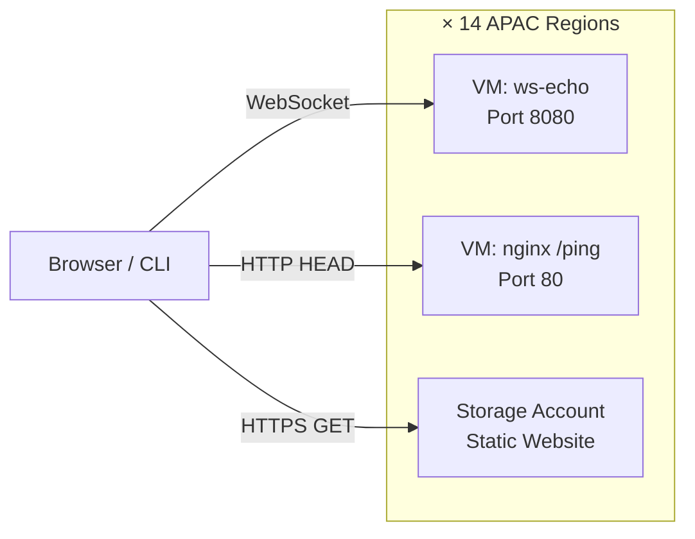

# Architecture
{: .no_toc }

## Table of Contents
{: .no_toc .text-delta }

1. TOC
{:toc}

---

## Overview



## Per-Region Resources

Each of the 14 regions contains:

| Resource | Name Pattern | Purpose |
|----------|-------------|--------|
| Resource Group | `rg-latency-{region}` | Logical container |
| VM | `vm-latency-{region}` | WebSocket + HTTP endpoint |
| NSG | `nsg-latency-{region}` | Firewall rules (80, 8080) |
| Public IP | `pip-latency-{region}` | Static IP for testing |
| Storage Account | `latency{region}` | Blob latency endpoint |

## Latency Measurement Types

### WebSocket (Primary)
- Persistent TCP connection on port 8080
- Measures true round-trip time for data echoing
- Most accurate for real-time application latency

### HTTP Ping
- HEAD request to nginx on port 80
- Measures HTTP request/response overhead
- Includes TCP + TLS setup on each request

### Blob Storage
- HEAD request to Azure Storage static website
- Measures storage infrastructure latency
- Includes DNS + TLS + storage front-end processing

## Network Path

```
Client → ISP → Azure backbone → Region POP → VM NIC → Application
```

Latency is dominated by:
1. **Physical distance** (speed of light in fiber)
2. **Network hops** (routing efficiency)
3. **TLS overhead** (for HTTPS/WSS)
4. **Application processing** (negligible for echo)

---

[← Prerequisites](../01-prerequisites/){: .btn .mr-2 }
[Next: Deploy Infrastructure →](../03-deploy-infrastructure/){: .btn .btn-primary }
