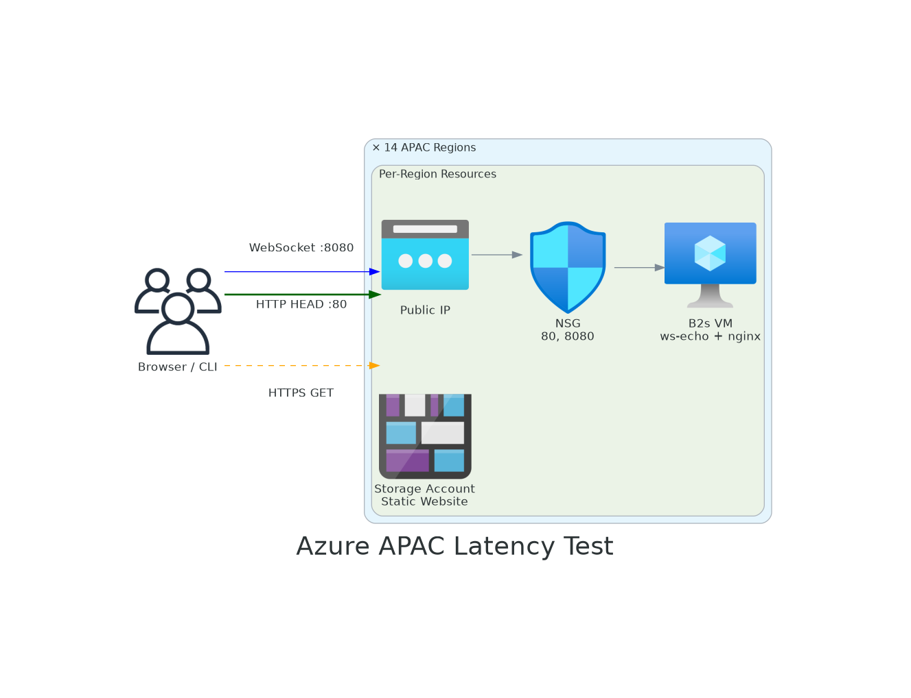
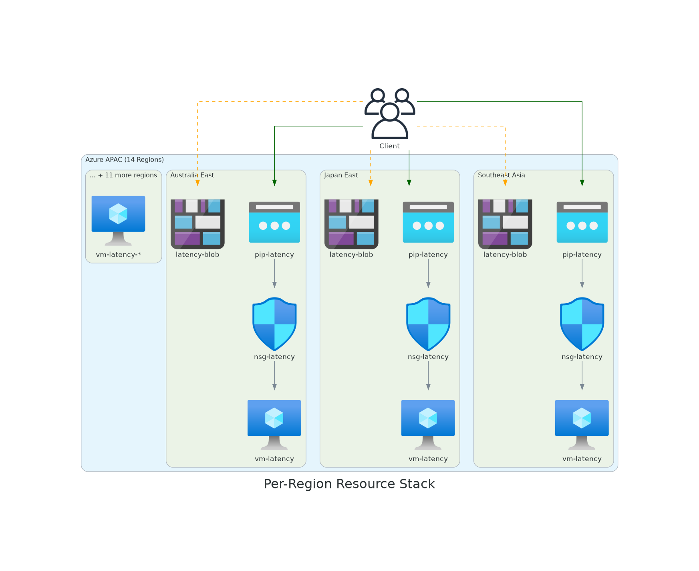
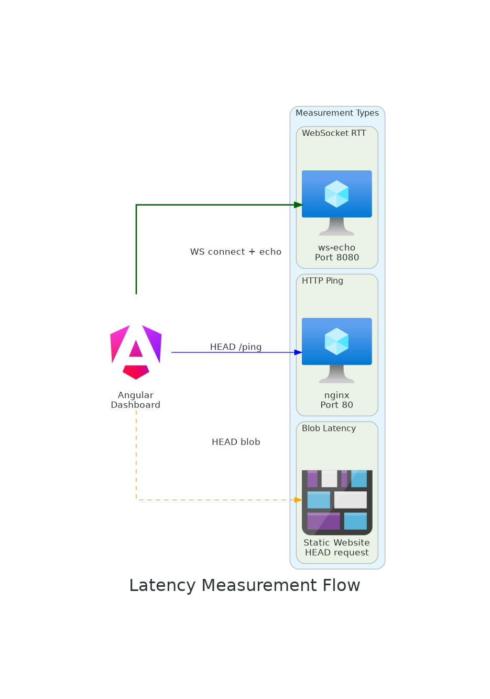

# Architecture
{: .no_toc }

## Table of Contents
{: .no_toc .text-delta }

1. TOC
{:toc}

---

## Overview



The **Azure APAC Latency Test** is a distributed measurement platform that deploys lightweight infrastructure across 14 Azure regions in Asia-Pacific. It enables real-time latency measurement from any client browser using three complementary protocols — WebSocket, HTTP, and Blob Storage — to provide a complete picture of network performance across the region.

### Design Goals

| Goal | Approach |
|------|----------|
| **Low cost** | Standard_B2s VMs (~$30/mo each), no premium SKUs |
| **Idempotent deployment** | Scripts can be re-run safely; create-or-skip logic |
| **Client-side measurement** | All latency measured from the browser — no server-to-server |
| **Multi-protocol** | WebSocket (persistent), HTTP (request/response), Blob (storage layer) |
| **Minimal dependencies** | Azure CLI only, no Terraform/Bicep required |
| **Comprehensive APAC coverage** | 14 regions including new markets (Indonesia, Malaysia, New Zealand) |

### Technology Stack

| Layer | Technology | Details |
|-------|-----------|---------|
| **Frontend** | Angular 17 | Real-time dashboard with Chart.js visualizations |
| **WebSocket Server** | Node.js + `ws` | Echo server on port 8080, measures true RTT |
| **HTTP Server** | nginx | Lightweight reverse proxy, HEAD request on port 80 |
| **Storage** | Azure Blob (Static Website) | 1KB test payload, measures storage layer latency |
| **Compute** | Ubuntu 24.04 LTS on B2s | cloud-init provisioned, systemd-managed services |
| **Networking** | NSG + Public IP (Static) | Inbound 80/8080 only, no outbound restrictions |
| **Deployment** | Bash + Azure CLI | Idempotent scripts in `deploy/` directory |

### How It Works

1. **Deploy** — Azure CLI scripts provision 14 VMs + 14 Storage Accounts across APAC
2. **Measure** — Angular app opens connections from the user's browser to each region
3. **Compare** — Dashboard shows latency differences by protocol and region in real-time
4. **Analyze** — Results reveal physical distance impact, protocol overhead, and regional maturity

## Per-Region Resources



Each of the 14 regions contains:

| Resource | Name Pattern | Purpose |
|----------|-------------|--------|
| Resource Group | `rg-latency-{region}` | Logical container |
| VM | `vm-latency-{region}` | WebSocket + HTTP endpoint |
| NSG | `nsg-latency-{region}` | Firewall rules (80, 8080) |
| Public IP | `pip-latency-{region}` | Static IP for testing |
| Storage Account | `latency{region}` | Blob latency endpoint |

## Latency Measurement Types



### WebSocket (Primary)
- Persistent TCP connection on port 8080
- Measures true round-trip time for data echoing
- Most accurate for real-time application latency

### HTTP Ping
- HEAD request to nginx on port 80
- Measures HTTP request/response overhead
- Includes TCP + TLS setup on each request

### Blob Storage
- HEAD request to Azure Storage static website
- Measures storage infrastructure latency
- Includes DNS + TLS + storage front-end processing

## Network Path

```
Client → ISP → Azure backbone → Region POP → VM NIC → Application
```

Latency is dominated by:
1. **Physical distance** (speed of light in fiber)
2. **Network hops** (routing efficiency)
3. **TLS overhead** (for HTTPS/WSS)
4. **Application processing** (negligible for echo)

## Regenerating Diagrams

The architecture diagrams are generated using [mingrammer/diagrams](https://github.com/mingrammer/diagrams). To regenerate:

```bash
pip install diagrams
cd docs/diagrams
python3 architecture.py
```

---

[← Prerequisites](../01-prerequisites/){: .btn .mr-2 }
[Next: Deploy Infrastructure →](../03-deploy-infrastructure/){: .btn .btn-primary }
