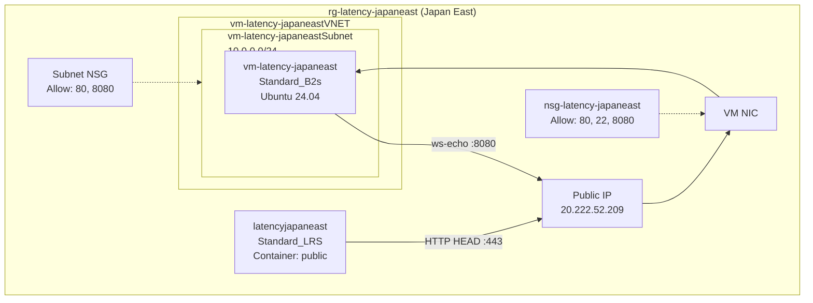

# Generate Architecture Visualizations with GitHub Copilot
{: .no_toc }

## Table of Contents
{: .no_toc .text-delta }

1. TOC
{:toc}

---

## Overview

Once your Azure Latency Test is deployed, use GitHub Copilot in VS Code with two skills to automatically generate architecture diagrams from your **live Azure resources**.

---

## Skill 1: Azure Resource Visualizer (Mermaid)

### Install the Skill

The skill is part of [microsoft/azure-skills](https://github.com/microsoft/azure-skills). Install it in VS Code:

1. Open VS Code
2. Open Copilot Chat (`Ctrl+Shift+I`)
3. The skill is auto-available if you have the GitHub Copilot for Azure extension

### Example Prompts

#### Single Resource Group — Frontend

```
@azure create an architecture diagram for resource group rg-latency-frontend-vm
```

**What it generates:** A Mermaid diagram showing the frontend VM, VNet, Subnet, NSG, Public IP, NIC, and OS Disk with their relationships.

---

#### Single Resource Group — Regional Echo Server

```
@azure create an architecture diagram for resource group rg-latency-japaneast
```

**What it generates:** A Mermaid diagram showing the VM, Storage Account, VNet, NSGs (NIC + Subnet level), and their interconnections.

---

#### Cross Resource Group — Full Architecture

```
@azure analyze and create an architecture diagram that shows the relationships across 
all resource groups matching the pattern rg-latency-*. Show how the frontend VM in 
rg-latency-frontend-vm connects to the regional echo VMs and storage accounts across 
all 14 regional resource groups. Group resources by their resource group boundary.
```

**What it generates:** A comprehensive Mermaid diagram with 15 subgraphs (one per RG), showing:
- Frontend RG with VM serving Angular SPA
- 14 regional RGs each with VM + Storage Account
- WebSocket connections (port 8080) from browser to each regional VM
- HTTP HEAD connections to each storage account for blob latency
- Resource group boundaries clearly delineated

---

#### Cross Resource Group — Networking Focus

```
@azure create a network topology diagram showing all VNets and NSGs across resource 
groups rg-latency-frontend-vm, rg-latency-australiaeast, rg-latency-southeastasia, 
and rg-latency-japaneast. Show the NSG rules that allow ports 80 and 8080, and 
highlight the dual-NSG pattern (NIC-level + Subnet-level).
```

---

#### Cross Resource Group — Storage Focus

```
@azure visualize all storage accounts across resource groups matching rg-latency-*. 
Show each storage account's blob container, the CORS configuration, and how the 
browser connects to each one via HTTP HEAD for latency measurement.
```

---

#### Cross Resource Group — Comparison Pattern

```
@azure create an architecture diagram comparing the resource composition of 
rg-latency-frontend-vm vs rg-latency-koreacentral. Show what's common and what's 
different between the frontend resource group and a regional resource group.
```

---

### Expected Output (Single RG Example)

The skill generates a markdown file like `rg-latency-japaneast-architecture.md`:

````markdown
# rg-latency-japaneast Architecture

## Summary
This resource group contains a latency measurement endpoint in the Japan East 
(Tokyo) Azure region...

## Resource Inventory

| Resource | Type | SKU |
|----------|------|-----|
| vm-latency-japaneast | Virtual Machine | Standard_B2s |
| latencyjapaneast | Storage Account | Standard_LRS |
| nsg-latency-japaneast | Network Security Group | — |
| vm-latency-japaneastVNET | Virtual Network | — |

## Architecture Diagram


````

---

## Skill 2: Draw.io MCP Diagramming (`.drawio` file)

### Install the Skill

From [thomast1906/github-copilot-agent-skills](https://github.com/thomast1906/github-copilot-agent-skills/tree/main/.github/skills/drawio-mcp-diagramming):

1. Add the MCP server to your VS Code workspace settings (`.vscode/mcp.json`):

```json
{
  "servers": {
    "drawio": {
      "type": "http",
      "url": "https://mcp.draw.io/mcp"
    }
  }
}
```

2. Install the skill file into `.github/skills/drawio-mcp-diagramming/SKILL.md` or add as a Copilot custom instruction.

### Example Prompts

#### Single Resource Group — with Azure2 Icons

```
Create a draw.io architecture diagram for resource group rg-latency-frontend-vm 
using Azure2 icons. Include the VM, VNet, Subnet, NSG, Public IP, and NIC. 
Use network topology patterns with thick VNet borders and dashed subnet borders.
Save as docs/rg-latency-frontend-vm-architecture.drawio
```

---

#### Cross Resource Group — Full Infrastructure Diagram

```
Create a draw.io diagram showing the complete Azure Latency Test architecture across 
all 15 resource groups. Use these layout rules:
- rg-latency-frontend-vm at the top (blue container, strokeWidth=4)
- 14 regional resource groups in a grid below (7 columns × 2 rows)
- Color code: green for AU/NZ, yellow for SE/East Asia, purple for JP/KR, red for India
- Each RG container shows: VM icon, Storage Account icon, NSG icon, VNet icon, PIP icon
- Add edges from browser to frontend (HTTP :80) and browser to each regional VM (WS :8080)
- Use Azure2 icon library (img/lib/azure2/compute/Virtual_Machine.svg etc.)
- Canvas size: 2200x1400
- Include a legend box
Save as docs/azure-latency-test-architecture.drawio
```

---

#### Cross Resource Group — Data Flow Diagram

```
Create a draw.io sequence diagram showing the latency test data flow:
1. User browser loads Angular SPA from frontend VM (HTTP :80)
2. Browser opens WebSocket to regional VM (WS :8080)
3. Browser sends {t: timestamp} and receives echo back
4. Browser calculates RTT from 3 rounds
5. Browser sends HTTP HEAD to regional storage account
6. Browser calculates blob latency from 3 rounds

Use swimlane layout with actors: Browser, Frontend VM, Regional VM, Storage Account.
Apply the standard color palette from drawio-mcp-diagramming skill.
Save as docs/latency-test-dataflow.drawio
```

---

#### Cross Resource Group — Network Security Diagram

```
Create a draw.io network topology diagram showing the NSG configuration pattern across 
rg-latency-frontend-vm and 3 sample regional resource groups (rg-latency-japaneast, 
rg-latency-australiaeast, rg-latency-centralindia). For each RG show:
- VNet with thick green border (strokeWidth=4)
- Subnet with dashed border inside VNet
- NIC-level NSG (ports 80, 22, 8080)
- Subnet-level NSG (ports 80, 8080) - note: name is truncated to 80 chars by Azure
- Traffic flow arrows with protocol labels using standard color palette
- Red arrows for denied traffic
Include a network isolation explanation box.
Save as docs/nsg-topology.drawio
```

---

## Tips for Cross-Resource Group Prompts

| Technique | Example |
|-----------|---------|
| Use wildcard patterns | `"resource groups matching rg-latency-*"` |
| Specify the relationship | `"show how frontend VM connects to regional VMs via WebSocket"` |
| Request grouping | `"group resources by their resource group boundary"` |
| Set layout constraints | `"7 columns × 2 rows grid layout"` |
| Ask for comparison | `"compare composition of frontend RG vs regional RG"` |
| Specify protocols | `"label connections with WS :8080 and HTTP HEAD :443"` |
| Color coding | `"color code by geography: green AU/NZ, yellow Asia, purple JP/KR, red India"` |

## Key Prompt Patterns for Multi-RG Architectures

### Pattern 1: Enumerate and Visualize

```
List all resource groups in my subscription matching rg-latency-*, then create a 
single architecture diagram showing all of them with their internal resources and 
cross-group connections.
```

### Pattern 2: Hub-and-Spoke View

```
Create a diagram showing rg-latency-frontend-vm as the hub, with all 14 regional 
resource groups as spokes. Show the WebSocket (port 8080) connections from the 
frontend to each regional VM, and the HTTP HEAD connections to each storage account.
```

### Pattern 3: Resource Type Pivot

```
Create a diagram that groups all VMs together, all Storage Accounts together, and 
all NSGs together — across all rg-latency-* resource groups. Show the quantity and 
naming pattern for each resource type.
```

### Pattern 4: Per-Region Detail + Cross-Region Overview

```
Create two diagrams:
1. A detailed diagram of rg-latency-southeastasia showing all resources and their 
   configurations
2. A high-level diagram showing all 15 resource groups with just the key resources 
   (VM + Storage) and their cross-region connections
```

---

## Sample Generated Outputs

After running these prompts, you'll have:

```
docs/
├── rg-latency-frontend-vm-architecture.md          (Mermaid - single RG)
├── rg-latency-japaneast-architecture.md            (Mermaid - single RG)
├── azure-latency-full-architecture.md              (Mermaid - cross RG)
├── azure-latency-test-architecture.drawio          (Draw.io - full architecture)
├── latency-test-dataflow.drawio                    (Draw.io - sequence diagram)
└── nsg-topology.drawio                             (Draw.io - network security)
```

---

> **Tip:** The Azure Resource Visualizer skill reads **live resources** from your Azure subscription. The diagrams are always up-to-date with your actual deployment.
{: .note }

---

> **Back to:** [8. Azure Visualizer Demo](../)
