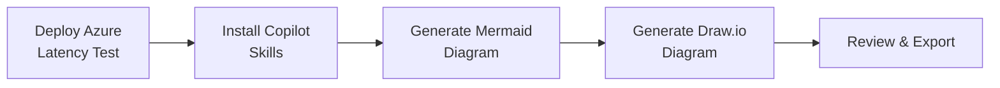

# Azure Resource Visualizer Demo
{: .no_toc .fs-9 }

Generate architecture diagrams from live Azure resources using GitHub Copilot skills — no manual drawing required.
{: .fs-6 .fw-300 }

---

## What You'll Learn

This module demonstrates how to use **GitHub Copilot in VS Code** with two skills to automatically generate architecture diagrams from your deployed Azure Latency Test infrastructure:

| Skill | Source | Output |
|-------|--------|--------|
| **Azure Resource Visualizer** | [microsoft/azure-skills](https://github.com/microsoft/azure-skills/blob/main/skills/azure-resource-visualizer/SKILL.md) | Mermaid diagram in `.md` |
| **Draw.io MCP Diagramming** | [thomast1906/github-copilot-agent-skills](https://github.com/thomast1906/github-copilot-agent-skills/tree/main/.github/skills/drawio-mcp-diagramming) | `.drawio` file with Azure2 icons |

## Prerequisites

Before starting this module, you must have:

- ✅ Completed [Module 3: Deploy Infrastructure](../03-deploy-infrastructure/) — resources must be live in Azure
- ✅ VS Code with GitHub Copilot extension installed
- ✅ Azure CLI logged in (`az login`)
- ✅ Active Azure subscription with deployed latency test resources

## Demo Flow

## Submodules

| # | Module | Description |
|---|--------|-------------|
| 8.1 | [Deploy the Latency Test](deploy-latency-test/) | Clone repo, deploy infrastructure |
| 8.2 | [Generate Visualizations](generate-visualizations/) | Use Copilot skills to create diagrams |
